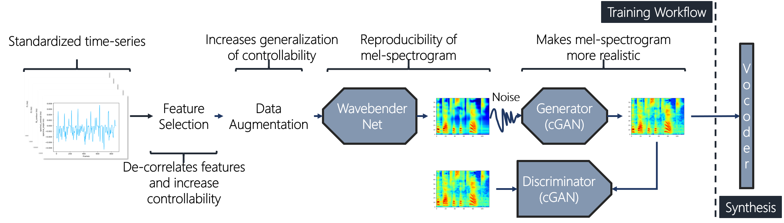
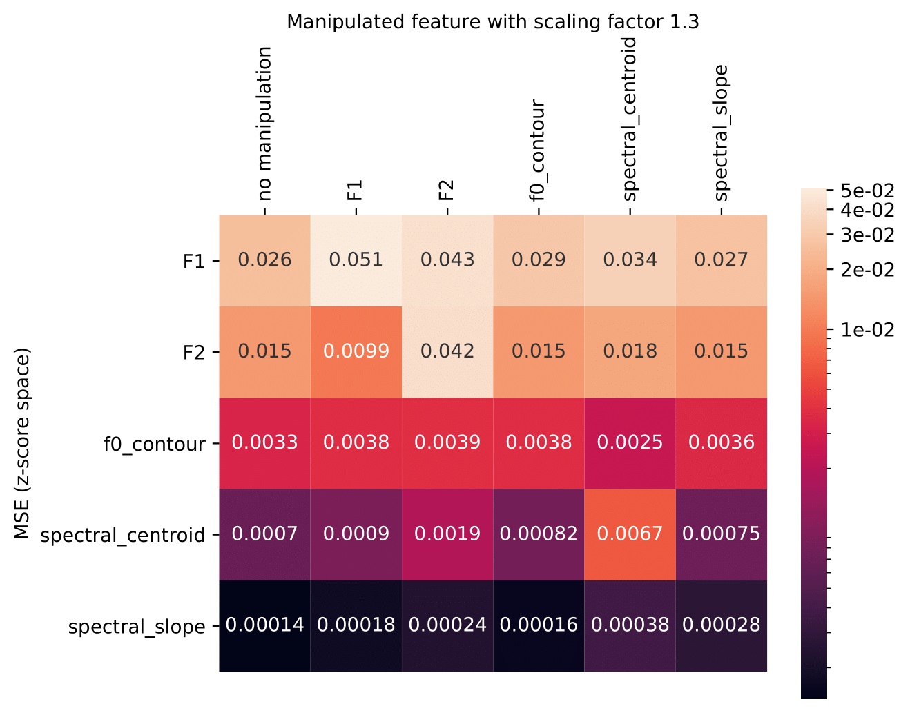

# Wavebender GAN
An architecture for phonetically meaningful speech manipulation
##### [Gustavo Teodoro Döhler Beck][gustavo_profile], [Ulme Wennberg][ulme_profile], [Zofia Malisz][zofia_profile], [Gustav Eje Henter][gustav_profile]


<head> 
<link rel="apple-touch-icon" sizes="180x180" href="favicon/apple-touch-icon.png">
<link rel="icon" type="image/png" sizes="32x32" href="favicon/favicon-32x32.png">
<link rel="icon" type="image/png" sizes="16x16" href="favicon/favicon-16x16.png">
<link rel="manifest" href="/site.webmanifest">
<link rel="mask-icon" href="/safari-pinned-tab.svg" color="#5bbad5">
<meta name="msapplication-TileColor" content="#da532c">
<meta name="theme-color" content="#ffffff">
</head>
<!-- This post presents Wavebender GAN, a deep architecture for controllable, high-quality speech synthesis intended for speech-sciences research -->

[github_link]: https://github.com/gustavo-beck/wavebender-gan
[gustav_profile]: https://people.kth.se/~ghe/
[gustavo_profile]: https://www.linkedin.com/in/gustavotbeck/
[ulme_profile]: https://www.kth.se/profile/ulme
[zofia_profile]: https://www.kth.se/profile/malisz
[hifi_link]: https://github.com/jik876/hifi-gan
[ljspeech_link]: https://keithito.com/LJ-Speech-Dataset/

## Summary

The goal of this work is to develop new speech technology to meet the needs of speech-sciences research. Specifically, our paper presents Wavebender GAN, a deep-learning architecture for manipulating phonetically-relevant speech parameters whilst remaining perceptually close to natural speech.

Our example system demonstrated on this webpage was trained on the [LJ Speech][ljspeech_link] dataset and uses the [HiFi-GAN][hifi_link] neural vocoder to produce waveforms, but the proposed method applies to other training data, vocoders, and speech parameters as well.

## Visual overview



## Code

Code is provided in [our GitHub repository][github_link].

<style type="text/css">
  .tg {
    border-collapse: collapse;
    border-color: #9ABAD9;
    border-spacing: 0;
  }

  .tg td {
    background-color: #EBF5FF;
    border-color: #9ABAD9;
    border-style: solid;
    border-width: 1px;
    color: #444;
    font-family: Arial, sans-serif;
    font-size: 14px;
    overflow: hidden;
    padding: 0px 20px;
    word-break: normal;
    font-weight: bold;
    vertical-align: middle;
  }

  .tg th {
    background-color: #409cff;
    border-color: #9ABAD9;
    border-style: solid;
    border-width: 1px;
    color: #fff;
    font-family: Arial, sans-serif;
    font-size: 14px;
    font-weight: normal;
    overflow: hidden;
    padding: 0px 20px;
    word-break: normal;
    font-weight: bold;
    vertical-align: middle;

  }

  .tg .tg-0pky {
    border-color: inherit;
    text-align: center;
    vertical-align: top,
  }

  .tg .tg-fymr {
    border-color: inherit;
    font-weight: bold;
    text-align: center;
    vertical-align: top
  }
  .slider {
  -webkit-appearance: none;
  width: 75%;
  height: 15px;
  border-radius: 5px;  
  background: #d3d3d3;
  outline: none;
  opacity: 0.7;
  -webkit-transition: .2s;
  transition: opacity .2s;
}

.slider::-webkit-slider-thumb {
  -webkit-appearance: none;
  appearance: none;
  width: 25px;
  height: 25px;
  border-radius: 50%; 
  background: #409cff;
  cursor: pointer;
}

.slider::-moz-range-thumb {
  width: 25px;
  height: 25px;
  border-radius: 50%;
  background: #409cff;
  cursor: pointer;
}
</style>

## Copy synthesis

The following audio stimuli illustrate the effects of copy synthesis (i.e., speech reconstruction) using different system components. No speech manipulation is performed at this point. All files are taken directly from the listening test in Sec. 5.3 of the paper.

<table class="tg">
  <thead>
    <tr>
      <th class="tg-0pky">Type</th>
      <th class="tg-0pky" colspan="1">Recorded natural speech</th>
      <th class="tg-0pky" colspan="1">Wavebender GAN&rarr;HiFi-GAN</th>
      <th class="tg-0pky" colspan="1">HiFi-GAN</th>
    </tr>
  </thead>
  <tbody>
    <tr>
      <td nowrap class="tg-0pky"><b>Sentence 1</b></td>
      <td class="tg-0pky">
        <audio id="audio-small" controls>
          <source src="./audios/Original/original_1.wav" type="audio/wav">
        </audio>
      </td>
      <td class="tg-0pky">
        <audio controls>
          <source src="./audios/WavebenderGAN/Reproduction/wavebendergan_1.wav" type="audio/wav">
        </audio>
      </td>
      <td class="tg-0pky">
        <audio controls>
          <source src="./audios/HiFiGAN/hifi_1.wav" type="audio/wav">
        </audio>
      </td>
    </tr>
  </tbody>
  
  <tbody>
    <tr>
      <td nowrap class="tg-0pky"><b>Sentence 2</b></td>
      <td class="tg-0pky">
        <audio id="audio-small" controls>
          <source src="./audios/Original/original_2.wav" type="audio/wav">
        </audio>
      </td>
      <td class="tg-0pky">
        <audio controls>
          <source src="./audios/WavebenderGAN/Reproduction/wavebendergan_2.wav" type="audio/wav">
        </audio>
      </td>
      <td class="tg-0pky">
        <audio controls>
          <source src="./audios/HiFiGAN/hifi_2.wav" type="audio/wav">
        </audio>
      </td>
    </tr>
  </tbody>
  
  <tbody>
    <tr>
      <td nowrap class="tg-0pky"><b>Sentence 3</b></td>
      <td class="tg-0pky">
        <audio id="audio-small" controls>
          <source src="./audios/Original/original_3.wav" type="audio/wav">
        </audio>
      </td>
      <td class="tg-0pky">
        <audio controls>
          <source src="./audios/WavebenderGAN/Reproduction/wavebendergan_3.wav" type="audio/wav">
        </audio>
      </td>
      <td class="tg-0pky">
        <audio controls>
          <source src="./audios/HiFiGAN/hifi_3.wav" type="audio/wav">
        </audio>
      </td>
    </tr>
  </tbody>
  
  <tbody>
    <tr>
      <td nowrap class="tg-0pky"><b>Sentence 4</b></td>
      <td class="tg-0pky">
        <audio id="audio-small" controls>
          <source src="./audios/Original/original_4.wav" type="audio/wav">
        </audio>
      </td>
      <td class="tg-0pky">
        <audio controls>
          <source src="./audios/WavebenderGAN/Reproduction/wavebendergan_4.wav" type="audio/wav">
        </audio>
      </td>
      <td class="tg-0pky">
        <audio controls>
          <source src="./audios/HiFiGAN/hifi_4.wav" type="audio/wav">
        </audio>
      </td>
    </tr>
  </tbody>
  
  <tbody>
    <tr>
      <td nowrap class="tg-0pky"><b>Sentence 5</b></td>
      <td class="tg-0pky">
        <audio id="audio-small" controls>
          <source src="./audios/Original/original_5.wav" type="audio/wav">
        </audio>
      </td>
      <td class="tg-0pky">
        <audio controls>
          <source src="./audios/WavebenderGAN/Reproduction/wavebendergan_5.wav" type="audio/wav">
        </audio>
      </td>
      <td class="tg-0pky">
        <audio controls>
          <source src="./audios/HiFiGAN/hifi_5.wav" type="audio/wav">
        </audio>
      </td>
    </tr>
  </tbody>
  
  <tbody>
    <tr>
      <td nowrap class="tg-0pky"><b>Sentence 6</b></td>
      <td class="tg-0pky">
        <audio id="audio-small" controls>
          <source src="./audios/Original/original_6.wav" type="audio/wav">
        </audio>
      </td>
      <td class="tg-0pky">
        <audio controls>
          <source src="./audios/WavebenderGAN/Reproduction/wavebendergan_6.wav" type="audio/wav">
        </audio>
      </td>
      <td class="tg-0pky">
        <audio controls>
          <source src="./audios/HiFiGAN/hifi_6.wav" type="audio/wav">
        </audio>
      </td>
    </tr>
  </tbody>
  
  <tbody>
    <tr>
      <td nowrap class="tg-0pky"><b>Sentence 7</b></td>
      <td class="tg-0pky">
        <audio id="audio-small" controls>
          <source src="./audios/Original/original_7.wav" type="audio/wav">
        </audio>
      </td>
      <td class="tg-0pky">
        <audio controls>
          <source src="./audios/WavebenderGAN/Reproduction/wavebendergan_7.wav" type="audio/wav">
        </audio>
      </td>
      <td class="tg-0pky">
        <audio controls>
          <source src="./audios/HiFiGAN/hifi_7.wav" type="audio/wav">
        </audio>
      </td>
    </tr>
  </tbody>
  
  <tbody>
    <tr>
      <td nowrap class="tg-0pky"><b>Sentence 8</b></td>
      <td class="tg-0pky">
        <audio id="audio-small" controls>
          <source src="./audios/Original/original_8.wav" type="audio/wav">
        </audio>
      </td>
      <td class="tg-0pky">
        <audio controls>
          <source src="./audios/WavebenderGAN/Reproduction/wavebendergan_8.wav" type="audio/wav">
        </audio>
      </td>
      <td class="tg-0pky">
        <audio controls>
          <source src="./audios/HiFiGAN/hifi_8.wav" type="audio/wav">
        </audio>
      </td>
    </tr>
  </tbody>
  
  <tbody>
    <tr>
      <td nowrap class="tg-0pky"><b>Sentence 9</b></td>
      <td class="tg-0pky">
        <audio id="audio-small" controls>
          <source src="./audios/Original/original_9.wav" type="audio/wav">
        </audio>
      </td>
      <td class="tg-0pky">
        <audio controls>
          <source src="./audios/WavebenderGAN/Reproduction/wavebendergan_9.wav" type="audio/wav">
        </audio>
      </td>
      <td class="tg-0pky">
        <audio controls>
          <source src="./audios/HiFiGAN/hifi_9.wav" type="audio/wav">
        </audio>
      </td>
    </tr>
  </tbody>
  
  <tbody>
    <tr>
      <td nowrap class="tg-0pky"><b>Sentence 10</b></td>
      <td class="tg-0pky">
        <audio id="audio-small" controls>
          <source src="./audios/Original/original_10.wav" type="audio/wav">
        </audio>
      </td>
      <td class="tg-0pky">
        <audio controls>
          <source src="./audios/WavebenderGAN/Reproduction/wavebendergan_10.wav" type="audio/wav">
        </audio>
      </td>
      <td class="tg-0pky">
        <audio controls>
          <source src="./audios/HiFiGAN/hifi_10.wav" type="audio/wav">
        </audio>
      </td>
    </tr>
  </tbody>
</table>

## Speech manipulation  

The following proof-of-concept examples illustrate the effects of using Wavebender GAN to manipulate different core speech parameters. For consistency, all manipulations were performed on the same LJ Speech utterance from the test set, namely LJ026-0014.

### Pitch

Wavebender GAN is capable of reducing and increasing the pitch (f0 contour) of the speech. These examples demonstrate global scaling of the f0 parameter.

<table class="tg">
  <thead>
    <tr>
      <th class="tg-0pky" colspan="1">-30%</th>
      <th class="tg-0pky" colspan="1">-15%</th>
      <th class="tg-0pky" colspan="1">LJ026-0014</th>
      <th class="tg-0pky" colspan="1">+15%</th>
      <th class="tg-0pky" colspan="1">+30%</th>
    </tr>
  </thead>
  <tbody>
    <tr>
      <td class="tg-0pky">
        <audio id="audio-small" controls>
          <source src="./audios/WavebenderGAN/Manipulation/LJ026-0014_low_30_f0_contour.wav" type="audio/wav">
        </audio>
      </td>
      <td class="tg-0pky">
        <audio id="audio-small" controls>
          <source src="./audios/WavebenderGAN/Manipulation/LJ026-0014_low_15_f0_contour.wav" type="audio/wav">
        </audio>
      </td>
      <td class="tg-0pky">
        <audio controls>
          <source src="./audios/WavebenderGAN/Manipulation/LJ026-0014.wav" type="audio/wav">
        </audio>
      </td>
      <td class="tg-0pky">
        <audio controls>
          <source src="./audios/WavebenderGAN/Manipulation/LJ026-0014_high_15_f0_contour.wav" type="audio/wav">
        </audio>
      </td>
      <td class="tg-0pky">
        <audio controls>
          <source src="./audios/WavebenderGAN/Manipulation/LJ026-0014_high_30_f0_contour.wav" type="audio/wav">
        </audio>
      </td>
    </tr>
  </tbody>
</table>

### Formants

These examples illustrate the effects of locally scaling the first formant, F1, for the last word of the utterance (i.e., &ldquo;forms&rdquo;). Since F1 and F2 are strongly correlated, we use the method described in Sec. 4.2 of the paper to predict new F2 values when manipulating F1.

<table class="tg">
  <thead>
    <tr>
      <th class="tg-0pky" colspan="1"></th>
      <th class="tg-0pky" colspan="1">&ldquo;Fools&rdquo; (-30% of F1)</th>
      <th class="tg-0pky" colspan="1">&ldquo;Forms&rdquo;</th>
      <th class="tg-0pky" colspan="1">&ldquo;Frogs&rdquo; (+30% of F1)</th>
    </tr>
  </thead>
  <tbody>
    <tr>
      <td nowrap class="tg-0pky"><b>Last word only</b></td>
      <td class="tg-0pky">
        <audio controls>
          <source src="./audios/WavebenderGAN/Manipulation/LJ026-0014_low_f1.wav" type="audio/wav">
        </audio>
      </td>
      <td class="tg-0pky">
        <audio controls>
          <source src="./audios/WavebenderGAN/Manipulation/LJ026-0014_forms.wav" type="audio/wav">
        </audio>
      </td>
      <td class="tg-0pky">
        <audio controls>
          <source src="./audios/WavebenderGAN/Manipulation/LJ026-0014_high_f1.wav" type="audio/wav">
        </audio>
      </td>
    </tr>
    <tr>
      <td nowrap class="tg-0pky"><b>Manipulation in context</b></td>
      <td class="tg-0pky">
        <audio controls>
          <source src="./audios/WavebenderGAN/Manipulation/LJ026-0014_low_f1_full.wav" type="audio/wav">
        </audio>
      </td>
      <td class="tg-0pky">
        <audio controls>
          <source src="./audios/WavebenderGAN/Manipulation/LJ026-0014.wav" type="audio/wav">
        </audio>
      </td>
      <td class="tg-0pky">
        <audio controls>
          <source src="./audios/WavebenderGAN/Manipulation/LJ026-0014_high_f1_full.wav" type="audio/wav">
        </audio>
      </td>
    </tr>
  </tbody>
</table>

### Spectral centroid

The following example suggests that global manipulation of spectral centroid (here multiplied by 1.3), although accurate in terms of relative MSE, is not particularly meaningful. The most notable effect is a kind of lisp, wherein [&#643;] becomes [&#952;]. This is to be expected, since spectral moments acoustically define places of articulation in English fricatives; see, e.g., A. Jongman, R. Wayland, and S. Wong, &ldquo;Acoustic characteristics of English fricatives,&rdquo; J. Acoust. Soc. Am., vol. 108, pp. 1252&ndash;1263, 2000, among others.

<audio controls>
  <source src="./audios/WavebenderGAN/Manipulation/LJ026-0014_high_spectral_centroid.wav" type="audio/wav">
</audio>
        
### Spectral slope

Global scaling of the spectral slope mainly appears to affect signal gain, as shown in the below example (spectral slope multiplied by 0.2). This effect might be a consequence of the significant correlation between speech loudness and spectral slope in human speech production.

<audio controls>
  <source src="./audios/WavebenderGAN/Manipulation/LJ026-0014_low_spectral_slope.wav" type="audio/wav">
</audio>

## Disentanglement

To quantify the extent of speech-parameter disentanglement with Wavebender GAN, this matrix shows the relative MSE for all speech parameters (vertical axis) as an effect of globally scaling each speech parameter (horizontal axis) by a factor 1.3, whilst keeping all other speech parameters fixed. As a baseline, the first column shows relative MSE values during copy-synthesis (no manipulation).



## Citation information

```
@inproceedings{beck2022wavebender,
   title={Wavebender {GAN}: {A}n architecture for phonetically meaningful speech manipulation},
   author={Döhler Beck, Gustavo Teodoro and Wennberg, Ulme and Malisz, Zofia and Henter, Gustav Eje},
   booktitle={Proc. ICASSP},
   year={2022}
 }
```

[](https://hits.seeyoufarm.com)
